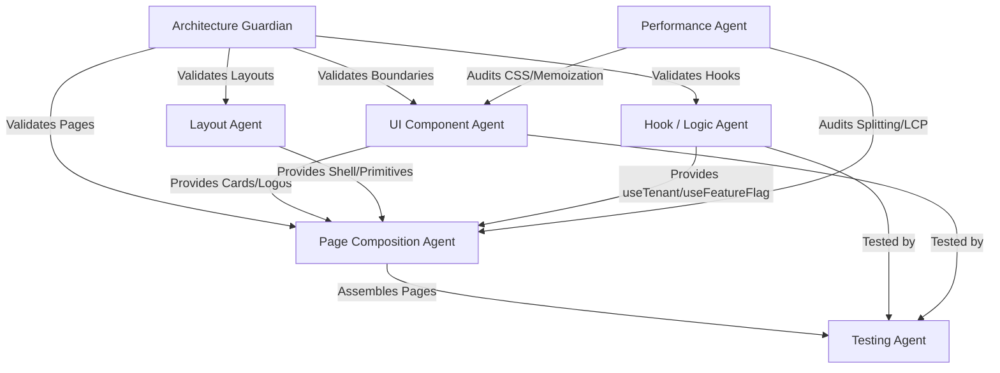

# Agentic AI Frontend Workflow System (Agnostic Spec)

This document describes the 7 specialized agent roles designed to manage, scale, and develop the Block Labs Frontend Ecosystem. This system is model-agnostic and applies interchangeably to Claude and Gemini agent teams.

---

## Agent Registry & File Ownership Matrix

| Agent Role | Primary Focus | Scope & File Ownership Boundaries |
| :--- | :--- | :--- |
| **1. UI Component Agent** | Stateless presentational units | `src/components/ui/**/*.tsx`, `*.module.css` |
| **2. Layout Agent** | Structural grid, shell, responsive primitives | `src/components/layout/**/*.tsx`, `*.module.css` |
| **3. Page Composition Agent** | Dynamic routing assembly and page controllers | `src/pages/**/*.tsx`, `src/app/router.tsx` |
| **4. Hook / Logic Agent** | Side effects, context states, client APIs | `src/hooks/**/*.ts`, `src/app/providers/**/*.tsx` |
| **5. Performance Agent** | Bundle efficiency, render loops, metrics | Audits codebase; adjusts `vite.config.ts`, React.memo, Suspense |
| **6. Testing Agent** | Behavior verification and coverage | `src/tests/**/*.test.tsx`, `src/tests/setup.ts` |
| **7. Architecture Guardian** | Registry constraints, boundary linting | Review agent; approves merge requests and refactor actions |

---

## Role Specifications & Quality Checklists

### 1. UI Component Agent
- **Responsibility**: Drafts accessible, presentational UI modules using Mantine component primitives.
- **Rules**:
  - Zero application logic, fetch statements, or route dependencies.
  - Colocate CSS Modules for unique class modifiers.
  - Implement full ARIA accessibility descriptors.
- **Checklist**:
  - [ ] Component is memoized using `React.memo`.
  - [ ] Component styling is done exclusively through CSS modules or Mantine props.
  - [ ] Component does not access global react-router state.

### 2. Layout Agent
- **Responsibility**: Designs structural viewport envelopes, headers, sidebars, grids, and skeleton slots.
- **Rules**:
  - Do not handle data operations directly. Consume layout parameters and child outlets.
  - Ensure breakpoint layout responsiveness (320px to 1440px).
- **Checklist**:
  - [ ] Mobile navigation states are managed locally or via light disclosures.
  - [ ] Theme configuration values are loaded dynamically from tenant context.

### 3. Page Composition Agent
- **Responsibility**: Composes layout envelopes, wraps child elements in Suspense states, and hooks business state logic to page renderers.
- **Rules**:
  - Build page elements at `src/pages/` and router mappings at `src/app/router.tsx`.
  - Split pages with `React.lazy` dynamically.
- **Checklist**:
  - [ ] Pages are asynchronously lazy loaded in router profiles.
  - [ ] Error boundary covers major route branches.

### 4. Hook / Logic Agent
- **Responsibility**: Manages client contexts, custom states, features gates, and hooks life cycles.
- **Rules**:
  - Standardize error handling and AbortController request cleanups.
  - Export strict TypeScript typings for state APIs.
- **Checklist**:
  - [ ] Dynamic fetch functions support cancellation tokens.
  - [ ] Hooks prevent infinite loops by using refs for callback values.

### 5. Performance Agent
- **Responsibility**: Reviews bundle size, restricts re-renders, and implements speculation rules or preloads for Core Web Vitals.
- **Rules**:
  - Audit `vite.config.ts` chunk rules to keep primary vendor size light (< 50KB gzipped).
  - Verify layout shifts are absent from loading states.
- **Checklist**:
  - [ ] LCP images use high fetchpriority, fonts are preloaded.
  - [ ] Large heavy libraries are dynamic chunked.

### 6. Testing Agent
- **Responsibility**: Writes clean unit and integration tests focusing on user-facing behavior.
- **Rules**:
  - Mock global states (matchMedia, ResizeObserver) in setup files.
  - Ensure test names describe expected output results, not implementation names.
- **Checklist**:
  - [ ] Coverage rates meet target requirements (>80%).
  - [ ] Tests assert accessibility attributes are rendered.

### 7. Architecture Guardian Agent
- **Responsibility**: Reviews changes from all other agents to prevent boundary leakage.
- **Rules**:
  - Block attempts to add state managers (e.g. Redux) unless explicitly authorized.
  - Enforce type safety guidelines.
- **Checklist**:
  - [ ] Code uses import type syntax for pure types.
  - [ ] Component nesting boundaries are correct.
