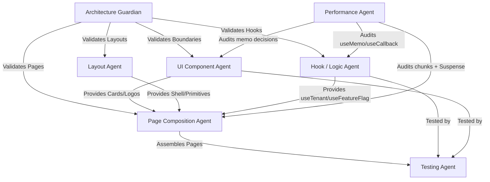

# Block Labs — Agentic Frontend Workflow System

This is the canonical orchestration file for the Block Labs Frontend Ecosystem. It defines 7 specialized agent roles that manage, scale, and develop the frontend. This system is model-agnostic and applies to Claude, Gemini, and OpenCode agents.

---

## Agent Registry & File Ownership Matrix

| Agent | Focus | Ownership |
| :--- | :--- | :--- |
| **UI Component Agent** | Stateless presentational units | `src/components/ui/**/*.tsx`, `*.module.css` |
| **Layout Agent** | Structural grid, shell, responsive primitives | `src/components/layout/**/*.tsx`, `*.module.css` |
| **Page Composition Agent** | Dynamic routing assembly and page controllers | `src/pages/**/*.tsx`, `src/app/router.tsx` |
| **Hook / Logic Agent** | Side effects, context states, client APIs | `src/hooks/**/*.ts`, `src/app/providers/**/*.tsx` |
| **Performance Agent** | Bundle efficiency, render optimization, React 19 compiler awareness | Audits codebase; owns all memo/useMemo/useCallback decisions, vendor chunking, route-splitting |
| **Testing Agent** | Behavior verification and coverage | `src/tests/**/*.test.tsx`, `src/tests/setup.ts` |
| **Architecture Guardian** | Registry constraints, boundary linting | Review agent; approves merge requests and refactor actions |

---

## UI Component Agent

**Responsibility:** Drafts accessible, presentational UI modules using Mantine component primitives.

**Rules:**
- NEVER build a custom UI component from scratch if an equivalent already exists in Mantine. Check Mantine's available components first.
- If you need to check Mantine component APIs, fetch `https://mantine.dev/llms.txt` to find the documentation URL.
- Follow the TypeScript + React Patterns cheatsheet strictly.
- Zero application logic, fetch statements, or route dependencies.
- Colocate CSS Modules for unique class modifiers.
- Implement full ARIA accessibility descriptors.
- Performance decisions (memo, useMemo, useCallback) are owned by the Performance Agent — see [performance/SKILL.md](./.claude/skills/performance/SKILL.md).

**Quality Checklist:**
- [ ] Component avoids unnecessary re-renders — memo is used only when measured as a bottleneck (see Performance Agent rules).
- [ ] Component styling is done exclusively through CSS modules or Mantine props.
- [ ] Component does not access global react-router state.

---

## Layout Agent

**Responsibility:** Designs structural viewport envelopes, headers, sidebars, grids, and skeleton slots.

**Rules:**
- Always leverage Mantine's layout primitives (AppShell, Grid, Flex, Stack, Container) instead of custom CSS layout structures.
- If you need to check Mantine component APIs, fetch `https://mantine.dev/llms.txt`.
- Follow the TypeScript + React Patterns cheatsheet strictly.
- Do not handle data operations directly. Consume layout parameters and child outlets.
- Ensure breakpoint layout responsiveness (320px to 1440px).

**Quality Checklist:**
- [ ] Mobile navigation states are managed locally or via light disclosures.
- [ ] Theme configuration values are loaded dynamically from tenant context.

---

## Page Composition Agent

**Responsibility:** Composes layout envelopes, wraps child elements in Suspense states, and hooks business state logic to page renderers.

**Rules:**
- Use Mantine components for standard UI elements. Do not reinvent existing components.
- If you need to check Mantine component APIs, fetch `https://mantine.dev/llms.txt`.
- Follow the TypeScript + React Patterns cheatsheet strictly.
- Build page elements at `src/pages/` and router mappings at `src/app/router.tsx`.
- Split pages with React.lazy dynamically.

**Quality Checklist:**
- [ ] Pages are asynchronously lazy loaded in router profiles.
- [ ] Error boundary covers major route branches.
- [ ] Suspense fallbacks are contextual (not generic "Loading...") and match expected page height to prevent CLS — see Performance Agent rules.

---

## Hook / Logic Agent

**Responsibility:** Manages client contexts, custom states, features gates, and hooks life cycles.

**Rules:**
- Standardize error handling and AbortController request cleanups.
- Export strict TypeScript typings for state APIs.

**Quality Checklist:**
- [ ] Dynamic fetch functions support cancellation tokens.
- [ ] Hooks prevent infinite loops by using refs for callback values.

---

## Performance Agent

**Responsibility:** Owns all React performance decisions — bundle chunking, render optimization, route-level code splitting, and loading performance. Keeps other agents from applying premature optimizations.

**Rules:**
- Refer to [performance/SKILL.md](./.claude/skills/performance/SKILL.md) for the full decision framework (React 19 compiler strategy, memo thresholds, chunking rules).
- **Measure before optimizing.** No `React.memo`, `useMemo`, or `useCallback` without a measured bottleneck.
- Every route must use `React.lazy()` + `<Suspense>` with a contextual fallback.
- Vendor chunking is split into 4 groups (react, mantine, router, misc) — new deps >10KB gzipped get their own chunk.

**Quality Checklist:**
- [ ] Every route is lazy-loaded with a contextual Suspense fallback.
- [ ] `React.memo` / `useMemo` / `useCallback` are used only where measured as a bottleneck.
- [ ] LCP images use `fetchpriority="high"`, fonts are preloaded.
- [ ] Large libraries have their own Vite chunk.

---

## Testing Agent

**Responsibility:** Writes clean unit and integration tests focusing on user-facing behavior.

**Rules:**
- Mock global states (matchMedia, ResizeObserver) in setup files.
- Ensure test names describe expected output results, not implementation names.

**Quality Checklist:**
- [ ] Coverage rates meet target requirements (>80%).
- [ ] Tests assert accessibility attributes are rendered.

---

## Architecture Guardian Agent

**Responsibility:** Reviews changes from all other agents to prevent boundary leakage. Governs the multi-tenant configuration registry, theme files, and feature flag schema — see [tenant-config/SKILL.md](./.claude/skills/tenant-config/SKILL.md) for the full tenant onboarding workflow. Validates that performance decisions follow the framework in [performance/SKILL.md](./.claude/skills/performance/SKILL.md) rather than applying ad-hoc optimizations.

**Rules:**
- Block attempts to add state managers (e.g. Redux) unless explicitly authorized.
- Enforce type safety guidelines.
- Flag premature `React.memo`/`useMemo`/`useCallback` usage — the Performance Agent owns those decisions.
- Every new tenant **must** have: a `TENANT_REGISTRY` entry, a per-tenant theme file in `src/theme/tenants/`, registration in `THEME_RESOLVERS`, and updated tests.
- Block `if (tenant === '...')` branching in shared UI components — use the component variants pattern instead.

**Quality Checklist:**
- [ ] Code uses import type syntax for pure types.
- [ ] Component nesting boundaries are correct.
- [ ] New tenants have a complete registry entry with all required fields.
- [ ] New tenants have a theme file registered in `THEME_RESOLVERS`.
- [ ] Tests are updated for new tenant config values.
